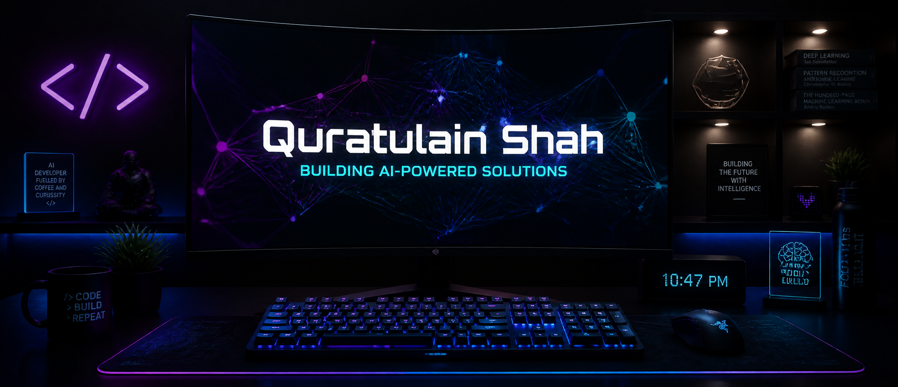

  <!-- Profile Banner -->
  

    

  <!-- Interactive Header Typing SVG -->
  

  
<strong>Crafting autonomous digital systems, advanced RAG architectures, and intelligence-driven workflows.</strong>

  <!-- Social -->
  

    
    
    
  

  <!-- LIVE COUNTERS — every number below is fetched at page load, never hardcoded -->
  

    
    
    
  

<!-- ══════════════════════════════════════════════════════════════
     LIVE IMPACT — all values pulled from the GitHub API on render
     ══════════════════════════════════════════════════════════════ -->
<h3 align="center">📈 Live Impact</h3>

  
  
  
  

   

  <i>Every badge on this page reads the GitHub API live — nothing here is typed by hand.</i>

### 🚀 Professional Summary

I am an **Agentic AI Engineer** and **Frontend Specialist** dedicated to bridging the gap between cutting-edge LLMs and production-grade software applications. I specialize in building autonomous multi-agent workflows, robust Retrieval-Augmented Generation (RAG) pipelines, and highly interactive user interfaces.

* 🤖 **AI-Assisted Workflows** — Designing autonomous agents that leverage tools, memory, and reasoning to complete complex, non-deterministic tasks.
* 🎨 **UX & Frontend Craftsmanship** — Building responsive, pixel-perfect, and highly functional web applications to make AI capabilities intuitive and accessible.
* 🌍 **Upstream First** — Every merged pull request on this profile landed in **someone else's repository**, not my own.

---

<!-- ══════════════════════════════════════════════════════════════
     UPSTREAM CONTRIBUTIONS — live merged-PR count per repository
     ══════════════════════════════════════════════════════════════ -->
### 🌐 Upstream Open Source Contributions

Merged pull requests in projects maintained by **GitHub, OpenAI, Pydantic, CrewAI and Hugging Face**.
Counts update themselves — each badge queries the GitHub search API on load.

<table>
<tr>
  <th align="left">Project</th>
  <th align="center">Merged</th>
  <th align="left">Focus</th>
</tr>

<tr>
  <td><a href="https://github.com/github/spec-kit"><b>github/spec-kit</b></a></td>
  <td align="center"></td>
  <td>Expression engine, catalog search, spec validation</td>
</tr>

<tr>
  <td><a href="https://github.com/openai/openai-agents-python"><b>openai/openai-agents-python</b></a></td>
  <td align="center"></td>
  <td>Agent SDK — tooling &amp; runtime behaviour</td>
</tr>

<tr>
  <td><a href="https://github.com/pydantic/pydantic-ai"><b>pydantic/pydantic-ai</b></a></td>
  <td align="center"></td>
  <td>Typed agent framework improvements</td>
</tr>

<tr>
  <td><a href="https://github.com/openclaw/openclaw"><b>openclaw/openclaw</b></a></td>
  <td align="center"></td>
  <td>Autonomous agent runtime</td>
</tr>

<tr>
  <td><a href="https://github.com/crewAIInc/crewAI"><b>crewAIInc/crewAI</b></a></td>
  <td align="center"></td>
  <td>Multi-agent orchestration — in review</td>
</tr>

<tr>
  <td><a href="https://github.com/huggingface/smolagents"><b>huggingface/smolagents</b></a></td>
  <td align="center"></td>
  <td>Lightweight agent primitives — in review</td>
</tr>
</table>

---

### 🏆 Featured Projects — the `spec-kit` ecosystem

<!-- Star / fork counters below are shields.io GitHub endpoints — always current. -->

<table>
<tr>
  <th align="left">Repository</th>
  <th align="center">Stars</th>
  <th align="center">Forks</th>
  <th align="left">What it does</th>
</tr>

<tr>
  <td><a href="https://github.com/Quratulain-bilal/spec-kit-brownfield"><b>spec-kit-brownfield</b></a></td>
  <td align="center"></td>
  <td align="center"></td>
  <td>Bring spec-driven workflows to existing codebases</td>
</tr>

<tr>
  <td><a href="https://github.com/Quratulain-bilal/spec-kit-bugfix"><b>spec-kit-bugfix</b></a></td>
  <td align="center"></td>
  <td align="center"></td>
  <td>Structured, reproducible bug-fix specifications</td>
</tr>

<tr>
  <td><a href="https://github.com/Quratulain-bilal/spec-kit-tinyspec"><b>spec-kit-tinyspec</b></a></td>
  <td align="center"></td>
  <td align="center"></td>
  <td>Minimal spec format for small, fast tasks</td>
</tr>

<tr>
  <td><a href="https://github.com/Quratulain-bilal/spec-kit-worktree"><b>spec-kit-worktree</b></a></td>
  <td align="center"></td>
  <td align="center"></td>
  <td>Git-worktree isolation for parallel agent runs</td>
</tr>

<tr>
  <td><a href="https://github.com/Quratulain-bilal/spec-kit-refine"><b>spec-kit-refine</b></a></td>
  <td align="center"></td>
  <td align="center"></td>
  <td>Iterative refinement passes over a spec</td>
</tr>

<tr>
  <td><a href="https://github.com/Quratulain-bilal/open_ai_sdk"><b>open_ai_sdk</b></a></td>
  <td align="center"></td>
  <td align="center"></td>
  <td>Hands-on OpenAI Agents SDK explorations</td>
</tr>
</table>

These counters read GitHub directly — they climb on their own, with no commit from me.

  

---

### 🧠 Core Expertise & Specializations

<table width="100%">
  <tr>
    <td width="50%" valign="top">
      <strong>🤖 Agentic AI Systems</strong>
      

      <ul>
        <li>🌀 <b>Multi-Agent Orchestration</b></li>
        <li>📂 <b>Advanced RAG Pipelines</b></li>
        <li>⚙️ <b>Structured Workflows (Spec-Kit)</b></li>
        <li>🔁 <b>Loop &amp; Harness Engineering</b></li>
      </ul>
    </td>
    <td width="50%" valign="top">
      <strong>🎨 Frontend Engineering</strong>
      

      <ul>
        <li>⚛️ <b>Modern Web UI (React / Next.js)</b></li>
        <li>⚡ <b>Dynamic UX/DX Flow</b></li>
        <li>📱 <b>Responsive &amp; Adaptive Layouts</b></li>
        <li>♿ <b>Accessible, Pixel-Perfect Interfaces</b></li>
      </ul>
    </td>
  </tr>
</table>

* **Autonomous Agents** — LLM planning, tool use, and reflective reasoning loops.
* **Data & Context Retrieval** — High-efficiency vector search (Qdrant / Pinecone) and context pipelines.
* **Workflow Orchestration** — Custom evaluators, validators, and "what-if" analysis for complex pipelines.

---

### 🛠️ Tech Stack & Ecosystem

<table width="100%">
  <tr>
    <td width="50%" valign="top">
      <h4>🤖 Artificial Intelligence &amp; LLMs</h4>
      
      
      
      
      
      
    </td>
    <td width="50%" valign="top">
      <h4>💻 Frontend &amp; Web</h4>
      
      
      
      
      
    </td>
  </tr>
  <tr>
    <td width="50%" valign="top">
      <h4>⚙️ Backend &amp; Frameworks</h4>
      
      
      
    </td>
    <td width="50%" valign="top">
      <h4>🛠️ Tools &amp; DevOps</h4>
      
      
      
      
    </td>
  </tr>
</table>

---

### 📊 GitHub Analytics

<!-- Primary cards: github-profile-summary-cards + streak-stats.
     These two services are stable. The github-readme-stats cards further down
     are a bonus — that project's free public instance is often rate-limited and
     serves 503, which renders as a broken image. If you see blanks there,
     self-host it (see: github.com/anuraghazra/github-readme-stats#deploy-on-your-own)
     and replace the domain in those URLs. -->

  

  
  

  
  

  

  
  

---

### ⚡ Recent GitHub Activity

<!--START_SECTION:activity-->
<!-- This block is rewritten automatically by .github/workflows/update-readme.yml -->
<!--END_SECTION:activity-->

   
  💡 <i>This profile keeps itself current: badges query the GitHub API on every view, and the activity feed above is refreshed on a schedule.</i>
    
  

---

\
